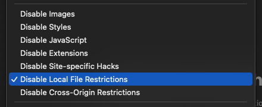

# Binary Documentation

The `imessage-exporter` binary exports iMessage data to `txt` or `html` formats. It can also run diagnostics to find problems with the iMessage database.

## Installation

There are several ways to install this software.

### Cargo (recommended)

This binary is available on [crates.io](https://crates.io/crates/imessage-exporter).

`cargo install imessage-exporter` is the best way to install the app for normal use.

<details><summary>Uninstall steps</code></summary><p><pre>% cargo uninstall imessage-exporter</pre></p></details>

### Homebrew

This binary is available via [`brew`](https://formulae.brew.sh/formula/imessage-exporter).

`brew install imessage-exporter` will install the app, but it may not be up to date with the latest release.

<details><summary>Uninstall steps</code></summary><p><pre>% brew uninstall imessage-exporter</pre></p></details>

### Prebuilt Binaries

The [releases page](https://github.com/ReagentX/imessage-exporter/releases) provides prebuilt binaries for both Apple Silicon and Intel-based Macs.

<details><summary>Uninstall steps</code></summary><p><pre>% rm path/to/imessage-exporter-binary</pre></p></details>

### Installing manually

- `clone` the repository
- `cd` to the repository
- `cargo run --release` to compile

## How To Use

```txt
-d, --diagnostics
        Print diagnostic information and exit

-f, --format <txt, html>
        Specify a single file format to export messages into

-c, --copy-method <compatible, efficient, disabled>
        Specify a method to use when copying message attachments
        Compatible will convert HEIC files to JPEG
        Efficient will copy files without converting anything
        If omitted, the default is `disabled`

-p, --db-path <path/to/source>
        Specify a custom path for the iMessage database location
        For macOS, specify a path to a `chat.db` file
        For iOS, specify a path to the root of an unencrypted backup directory
        If omitted, the default directory is ~/Library/Messages/chat.db

-a, --platform <macOS, iOS>
        Specify the platform the database was created on
        If omitted, the platform type is determined automatically

-o, --export-path <path/to/save/files>
        Specify a custom directory for outputting exported data
        If omitted, the default directory is ~/imessage_export

-s, --start-date <YYYY-MM-DD>
        The start date filter. Only messages sent on or after this date will be included

-e, --end-date <YYYY-MM-DD>
        The end date filter. Only messages sent before this date will be included

-l, --no-lazy
        Do not include `loading="lazy"` in HTML export `img` tags
        This will make pages load slower but PDF generation work

-m, --custom-name <custom-name>
        Specify an optional custom name for the database owner's messages in exports

-h, --help
        Print help information

-V, --version
        Print version information
```

### Examples

Export as `html` and copy attachments in web-compatible formats from the default iMessage Database location to your home directory:

```zsh
% imessage-exporter -f html -c compatible
```

Export as `txt` and copy attachments in their original formats from the default iMessage Database location to a new folder in the current working directory called `output`:

```zsh
% imessage-exporter -f txt -o output -c efficient
```

Export as `txt` from the an unencrypted iPhone backup located at `~/iphone_backup_latest` to a new folder in the current working directory called `backup_export`:

```zsh
% imessage-exporter -f txt -p ~/iphone_backup_latest -a iOS -o backup_export
```

Export as `html` from `/Volumes/external/chat.db` to `/Volumes/external/export` without copying attachments:

```zsh
% imessage-exporter -f html -c disabled -p /Volumes/external/chat.db -o /Volumes/external/export
```

Export messages from `2020-01-01` to `2020-12-31` as `txt` from the default macOS iMessage Database location to `~/export-2020`:

```zsh
% imessage-exporter -f txt -o ~/export-2020 -s 2020-01-01 -e 2021-01-01 -a macOS
```

## Features

[Click here](../docs/features.md) for a full list of features.

## Caveats

### HTML Exports

In HTML exports in Safari, when referencing files in-place, you must permit Safari to read from the local file system in the Develop menu:



Further, since the files are stored in `~/Library`, you will need to grant your browser Full Disk Access in System Settings.

### PDF Exports

I could not get PDF export to work in a reasonable way. The best way for a user to do this is to follow the steps above for Safari and print to PDF.

#### `wkhtmltopdf`

`wkhtmltopdf` refuses to render local images, even with the flag enabled like so:

```rust
let mut process = Command::new("wkhtmltopdf")
.args(&vec![
    "--enable-local-file-access".to_string(),
    html_path,
    pdf_path.to_string_lossy().to_string(),
])
.spawn()
.unwrap();
```

This persisted after granting `cargo`, `imessage-exporter`, and `wkhtmltopdf` Full Disk Access permissions as well as after copying files to the same directory as the `HTML` file.

#### Browser Automation

There are several `chomedriver` wrappers for Rust. The ones that use async make this binary too large (over `10mb`) and have too many dependencies. The sync implementation in the `headless-chrome` crate works, but [times out](https://github.com/atroche/rust-headless-chrome/issues/319) when generating large `PDF`s, even with an extreme timeout.
